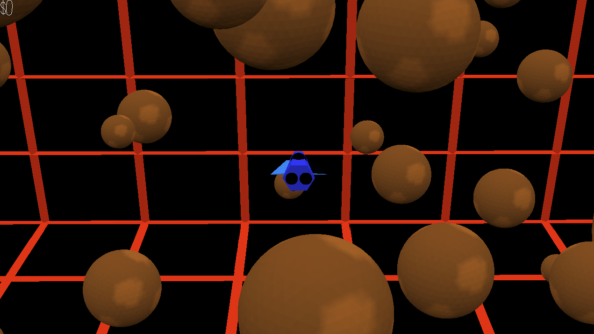

# (TODO: your game's title)

Author: Max Levine

Design: This is like the classic game asteroids, except in 3d.

Screen Shot:

How To Play:

Use the arrow keys to control the rocket, and use the spacebar to fire a missile. You are in a dense asteroid field, with different sized asteroids floating and bouncing off of each other. Don't crash into the asteroids or the wall. Mine the asteroids with your missile to earn points and clear out the asteroids.

## Extra Credit

Are your Physics Deterministic? If so, how can we verify this?

N/A

Are your Physics Rewindable? If so, how can we verify this?

N/A

This game was built with [NEST](NEST.md).
